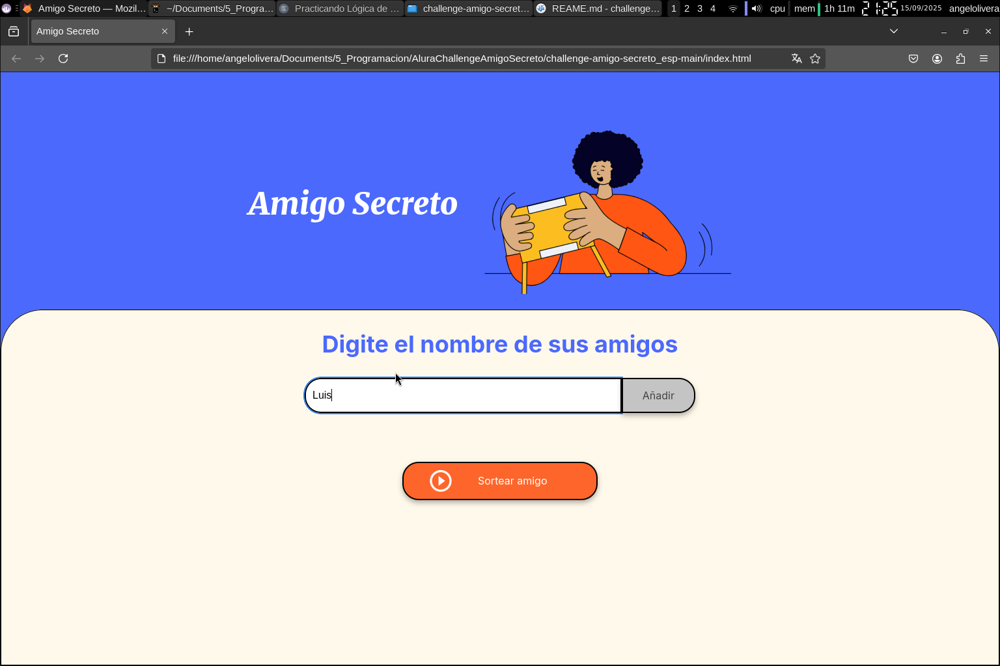
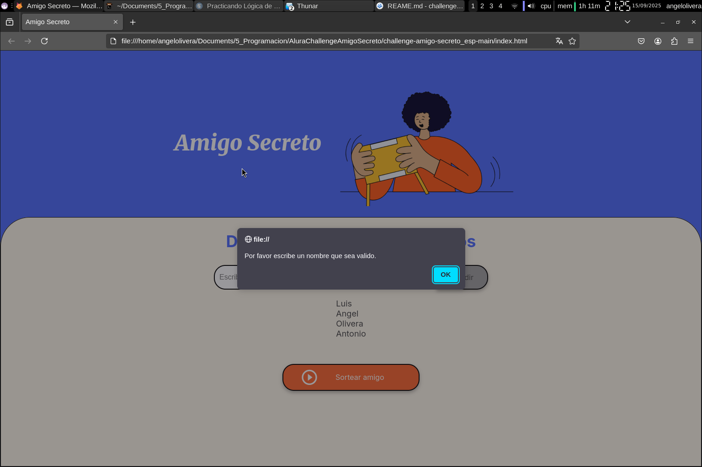
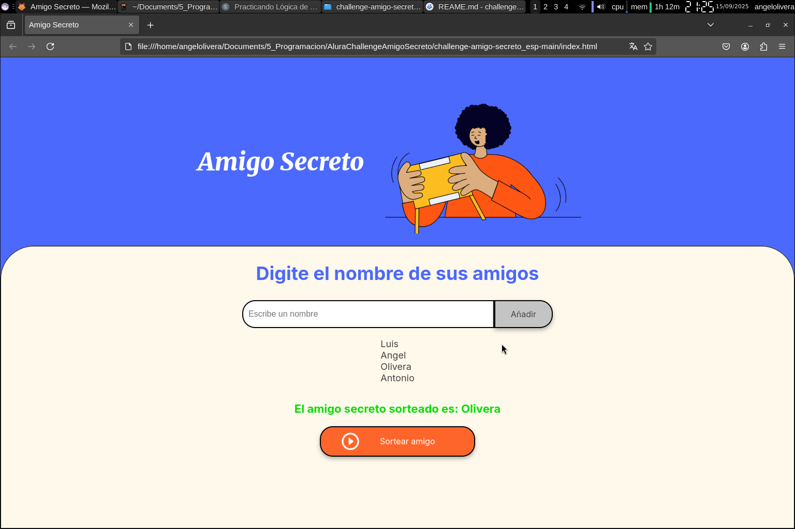

# Amigo Secreto 

El siguiente proyecto se basa en **Challenge de Alura Latam**,
este consiste en crear una aplicacion web que organize un sorteo de "Amigo secreto"

---

## Funcionalidades
- Agregar nombres de amigos a una lista.  
- Mostrar los nombres ingresados. 
- Valida que el nombre ingresado sea correcto. 
- Realizar un sorteo aleatorio.  
- Muestra el resultado del sorteo.

---

## Tecnologias empleadas
- HTML  
- CSS  
- JavaScript  

---

## Uso
1. Clonar el repositorio:
   git clone [git@github.com:ang3loliv3ra/alura-challenge-amigo-secreto.git](https://github.com/ang3loliv3ra/alura-challenge-amigo-secreto.git)
2. Acceder a la ruta en donde se clono el repositorio.
3. Abrir el archivo index.html
4. Agregar un nombre en el cuadro de texto.
5. Pulsamos el boton "Añadir".
6. Pulsamos el boton "Sortear amigo" despues de agregar los nombre que queramos.

--- 

## Capturas de pantalla
1. **Agregando amigos**  
   

2. **Error al intentar añadir un nombre vacío**  
   

3. **Resultado del sorteo**  
   

---

## Autor
Desarrollado por [@ang3loliv3ra](https://github.com/ang3loliv3ra)